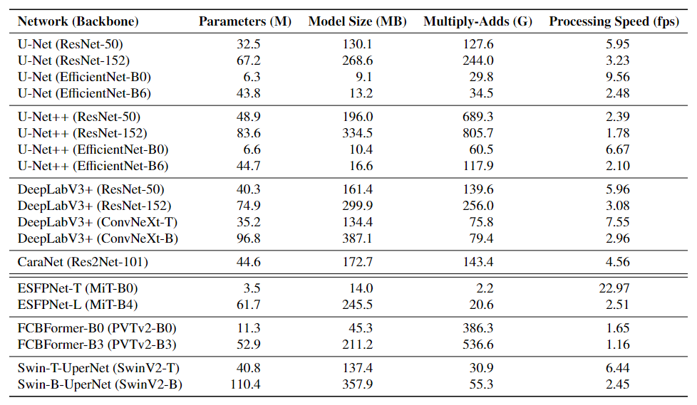

# CNNs vs. Transformers: Performance, Robustness and Generalization in Gastrointestinal Endoscopic Image Analysis
 
 This repository contains the codebases for the following publication(s):
 - Carolus H.J. Kusters *et al.* - CNNs vs. Transformers: Performance and Robustness in Endoscopic Image Analysis <br />  *Second Workshop on Applications of Medical AI (AMAI) - Satellite Event MICCAI 2023*
 - Carolus H.J. Kusters *et al.* - Will Transformers transform endoscopic AI? A comparative analysis between CNNs and Transformers, in terms of performance, robustness and generalization <br /> *Submission under Review*

## Folder Structure
The folder structure of this repository is as follows:

```bash
├── data
│   ├── dataset_public.py
│   └── dataset_wle.py
├── models
│   ├── CaraNet.py
│   ├── ConvNeXt.py
│   ├── ESFPNet.py
│   ├── FCBFormer.py
│   ├── ResNet.py
│   ├── SwinUperNet.py
│   ├── UNet.py
│   └── model_wle.py
├── preprocess
│   ├── generate_cache.py
│   └── generate_cache_public.py
├── utils
│   ├── loss_optim_wle.py
│   └── metrics_wle.py
├── pretrained
│   └── ...
├── conda.yaml
├── inference_public.py
├── inference_wle.py
├── train_public.py
├── train_wle
└── README.md
```

## Environment
The conda environment with the software dependencies for this project are specified in "conda.yaml".

## Pretrained models
The ImageNet pretrained weights are downloaded from the following links, and put under the "pretrained" folder: 
- CaraNet (Res2Net): https://github.com/Res2Net/Res2Net-PretrainedModels
- MiT: https://github.com/dumyCq/ESFPNet
- PvTv2: https://github.com/whai362/PVT/tree/v2/classification
- SwinV2: https://github.com/microsoft/Swin-Transformer

## Model Comparison
The study aims to comprehensively evaluate and compare the peak performance, generalization, robustness and complexity of several CNNs and Transformers for gastrointestinal endoscopic image analysis. The following models are involved in the comparison.


## Citation

If you think this helps, please use the following citation:
```bash
@InProceedings{10.1007/978-3-031-47076-9_3,
author="Kusters, Carolus H. J.
and Boers, Tim G. W.
and Jaspers, Tim J. M.
and Jukema, Jelmer B.
and Jong, Martijn R.
and Fockens, Kiki N.
and de Groof, Albert J.
and Bergman, Jacques J.
and van der Sommen, Fons
and de With, Peter H. N.",
editor="Wu, Shandong
and Shabestari, Behrouz
and Xing, Lei",
title="CNNs vs. Transformers: Performance and Robustness in Endoscopic Image Analysis",
booktitle="Applications of Medical Artificial Intelligence",
year="2024",
publisher="Springer Nature Switzerland",
address="Cham",
pages="21--31",
abstract="In endoscopy, imaging conditions are often challenging due to organ movement, user dependence, fluctuations in video quality and real-time processing, 
which pose requirements on the performance, robustness and complexity of computer-based analysis techniques. This paper poses the question whether Transformer-based 
architectures, which are capable to directly capture global contextual information, can handle the aforementioned endoscopic conditions and even outperform the 
established Convolutional Neural Networks (CNNs) for this task. To this end, we evaluate and compare clinically relevant performance and robustness of CNNs and 
Transformers for neoplasia detection in Barrett's esophagus. We have selected several top performing CNN and Transformers on endoscopic benchmarks, which we have 
trained and validated on a total of 10,208 images (2,079 patients), and tested on a total of 4,661 images (743 patients), divided over a high-quality test set 
and three different robustness test sets. Our results show that Transformers generally perform better on classification and segmentation for the high-quality challenging 
test set, and show on-par or increased robustness to various clinically relevant input data variations, while requiring comparable model complexity. 
This robustness against challenging video-related conditions and equipment variations over the hospitals is an essential trait for adoption in clinical practice. 
The code is made publicly available at: https://github.com/BONS-AI-VCA-AMC/Endoscopy-CNNs-vs-Transformers.",
isbn="978-3-031-47076-9"
}
```--->
